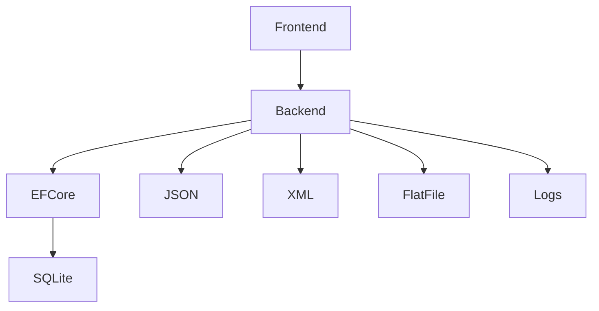

# Architecture

## Component Description

- **Frontend**: User interface built with ASP.NET Core MVC
- **Backend**: Business logic, controllers, services, logging
- **Entity Framework Core**: ORM for database access
- **SQLite**: Relational database for persistent storage
- **JSON, XML, Flat Files**: File-based storage for different entities
- **Logs**: Logging of all lending and return actions
