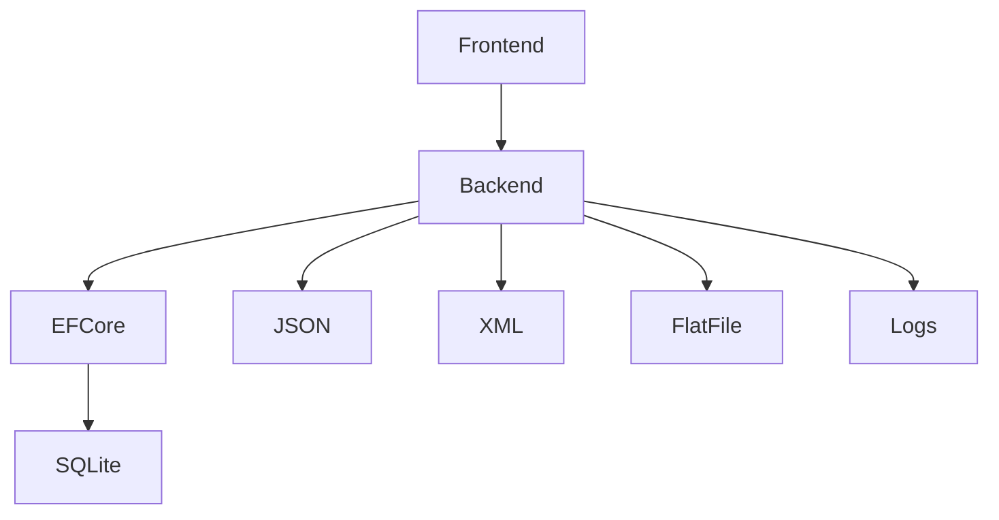

# Architektur

## Komponentenbeschreibung

- **Frontend**: Benutzeroberfläche mit ASP.NET Core MVC
- **Backend**: Geschäftslogik, Controller, Services, Logging
- **Entity Framework Core**: ORM für Datenbankzugriffe
- **SQLite**: Relationale Datenbank für persistente Speicherung
- **JSON, XML, Flat Files**: Dateibasierte Speicherung für verschiedene Entitäten
- **Logs**: Protokollierung aller Ausleih- und Rückgabeaktionen
