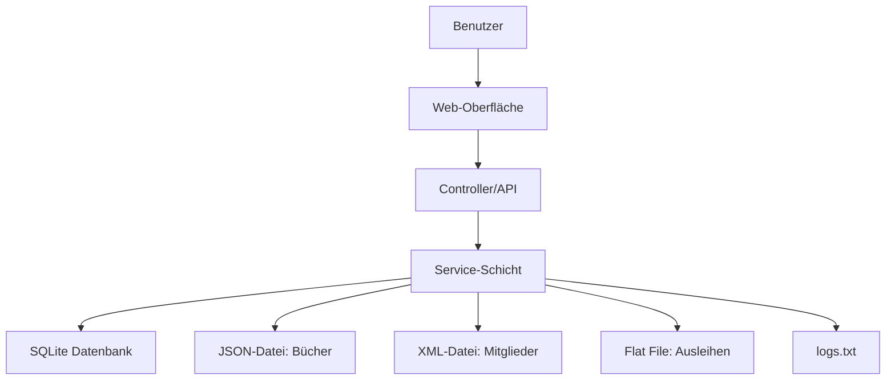

# Datenfluss

Beschreibt den Datenfluss im Projekt.

# Datenflussdiagramm

## Beschreibung
- **Benutzer** interagiert mit der Web-Oberfläche (UI).
- Die UI sendet Anfragen an die Controller/API.
- Die API ruft die Service-Schicht auf.
- Die Service-Schicht verarbeitet die Geschäftslogik und kommuniziert mit:
  - der SQLite-Datenbank (z.B. für persistente Daten)
  - JSON-Dateien (Bücher)
  - XML-Dateien (Mitglieder)
  - Flat Files (Ausleihen)
  - Logdatei (logs.txt) für Aktionen.
