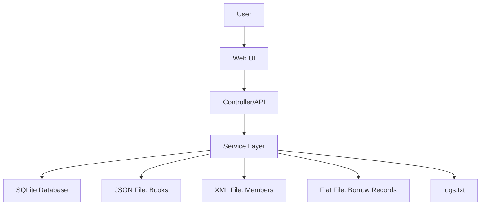

# Data Flow

Describes the data flow in the project.

# Data Flow Diagram

## Description
- **User** interacts with the web UI.
- The UI sends requests to the controllers/API.
- The API calls the service layer.
- The service layer processes business logic and communicates with:
  - the SQLite database (for persistent data)
  - JSON files (books)
  - XML files (members)
  - flat files (borrow records)
  - log file (logs.txt) for actions.
