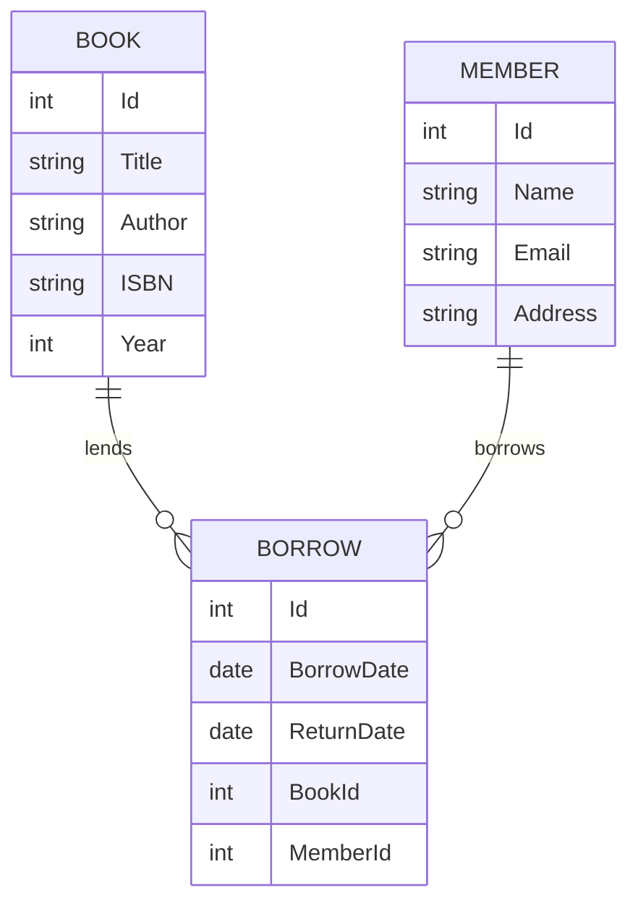

# ER-Diagram

Here is the Entity-Relationship-Diagram of the project.

# Entity Relationship Diagram (ERD)

## Description
- A **Member** can borrow multiple books (BORROW), a **Book** can be borrowed multiple times.
- The **BORROW** entity links books and members with borrow and return dates.
