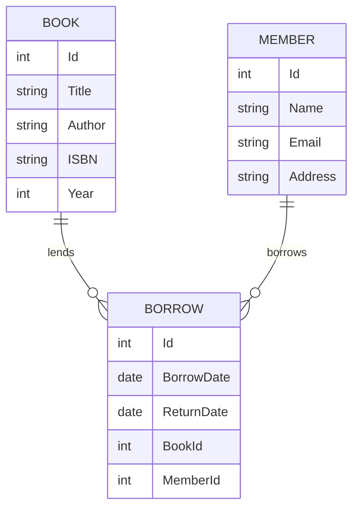

# ER-Diagramm

Hier befindet sich das Entity-Relationship-Diagramm des Projekts.

# Entity Relationship Diagram (ERD)

## Beschreibung
- Ein **Member** kann mehrere Bücher ausleihen (BORROW), ein **Book** kann mehrfach ausgeliehen werden.
- Die Entität **BORROW** verbindet Bücher und Mitglieder mit Ausleih- und Rückgabedatum.
